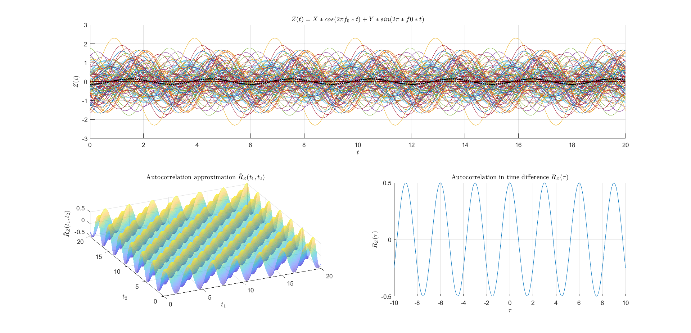

<style>
:root {
    --markdown-font-family: "Times New Roman", Times, serif;
    --markdown-font-size: 10.5pt;
}
</style>

<p class="supt1 center">Communication Theory</p>

# Lab 1 Report

<p class="subt2 center">
Academic year 2023-2024
</p>
<p class="subt2 center">
Alonso Herreros Copete, Jose Alberto Pastor Llorente
</p>

---

## 2. Analytical Description of a stochastic process

### Procedure

The random process was simulated by first generating 100 realizations of the random variables $X$ and $Y$ from
a normal distribution with mean $\mu = 0$ and variance $\sigma^2 = 1/2$ using the `normrnd` function. They
were stored in column vectors `X` and `Y`, white the time instants to be simulated were stored in a row vector
`t=0:0.5:20`.

Then, they were combned in pairs to form realizations of the random process $Z(t) = X(t) \cos(2\pi f_0 t) +
Y(t) \sin(2\pi f_0 t)$, where each X-Y pair resulted in one realization of $Z(t)$. Each realization of the
process was stored in a row of the vector `Z`, where each column contained the value at the instant
corresponding to that column of the time vector.

Then, the mean of all realizations was computed by using the `mean` function in the first dimension, yielding
a row vector `mZ` containing the mean of all realizations at each time instant. The average value of this
vector was computed by using the `mean` function once again, and the resulting average value was stored in
`mZavg`.

The correlation function $R_Z(t_1, t_2)$ was computed by creating a copy of the `Z` matrix in the third
dimension using the `permute` function, and then performing element-wise multiplication between the original
and this copy. The resulting 3D matrix was then averaged in the first dimension with `mean` and permuted back
into dimensions 1 & 2 (from 2 & 3), storing the result in `RZavg`.

Finally, the analytical $R_Z(\tau)$ was generated. First, the time difference vector `tau` was created using
`-10:0.5:10`, and then the values were computed using $R_Z = \sigma^2 \cos(2 \pi f_0 \tau)$

Then, the plots were generated in a 2x2 grid using `plot` and `surf`, using the first row for the simulation
and average time-domain plots, and the bottom left and right plots for the 3D and 2D autocorrelation plots,
respectively. The plots' parameters were adjsuted for aesthetics. The titles were written using LaTeX
syntax, which had to be set up for interpretation.

Additional plots were generated using a 0.1 time step to increase the resolution of the plots, since 0.5 was
too coarse.

### Results and plots




### Code

```Matlab
%% Clear
clear all;
set(groot,'defaulttextinterpreter','latex');  
set(groot, 'defaultLegendInterpreter', 'latex');

%% Distribution and simulation parameters
avg = 0;
var = 1/2;
stdev = sqrt(var);
f0 = 1/3; % frequency

tstep = 0.5;
t = (0:tstep:20);
N = 100; % realizations


%% Generate normal distribution
X = normrnd(avg, stdev, [N, 1]);
Y = normrnd(avg, stdev, [N, 1]);
Z = X.*cos(2*pi*f0*t) + Y.*sin(2*pi*f0*t);

%% Numerical computations
mZ = mean(Z, 1);
mZavg = mean(mZ);

RZ = permute(mean(Z.*permute(Z, [1, 3, 2])), [2,3,1]);
RZavg = mean(RZ, 'all');

tau = linspace(-10, 10, size(t, 2));
RZtau = var * cos(2 * pi * f0 * tau);

%% Plots
figure(1);
subplot(2, 2, 1:2, 'replace'); grid on; hold on;
title('$Z(t) = X*cos(2 \pi f_0*t) + Y*sin(2 \pi*f0*t)$', Interpreter='latex');
for i = 1:N
    plot(t, Z(i, :), HandleVisibility='off', LineWidth=0.1);
end
plot(t, mZ, Color='#660000', LineStyle=':', DisplayName='$m_Z(t)$', LineWidth=1.8);
plot(t, repmat(mZavg, size(t)), Color='black', LineStyle=':', DisplayName='$\hat{m}_Z(t)$', LineWidth=1.8);
legend('show');
xlabel('$t$'); ylabel('$Z(t)$');

subplot(2, 2, 3, 'replace');
title('Autocorrelation $R_Z(t_1, t_2)$', Interpreter='latex');
[t1_, t2_] = meshgrid(t);
surf(t1_, t2_, RZ, FaceAlpha=0.5, EdgeColor='none');
xlabel('$t_1$'); ylabel('$t_2$'); zlabel('$R_Z(t_1, t_2)$');

subplot(2, 2, 4, 'replace');
title('Autocorrelation in time difference $R_Z(\tau)$', Interpreter='latex');
plot(tau, RZtau);
xlabel('$\tau$'); ylabel('$R_Z(\tau)$');
```

## 3. Statistical Description of a stochastic process

### Procedure

The stochastic process was simulated using the given parameters passed to the `mvrnd` function (multi-variate
normal distribution), and the covariance matrix was computed usin the same method as in section 2. The 2D
covariance was computed using the following equation for Gaussian processes and the given expressions, using
the substitution $t_1 - t_j = \tau$:

$$
C_{ij} = R_X(t_i, t_j) - \mu_X(t_i) \mu_X(t_j) = R_X(t_i, t_j)
$$

### Results and plots


### Code

```Matlab
%% Setup
set(groot,'defaulttextinterpreter','latex');,
set(groot, 'defaultLegendInterpreter', 'latex');


%% Parameters

tstep = 0.1;
t = 0:tstep:10;
T = length(t);
N = 20;

stdev = 1/sqrt(2*pi); % Sigma
var = stdev^2; % Sigma squared

mX = zeros(size(t)); % Mu
CovX = exp(-(t-t').^2/(2*var));


%% Generate samples

X = mvnrnd(mX, CovX, N);
RX = permute(mean(X.*permute(X, [1, 3, 2])), [2,3,1]);

tau = -5:tstep:5;
RXtau = exp(-(tau).^2/(2*var)); 


%% Plot

figure(1);
subplot(2, 2, 1:2, 'replace'); grid on; hold on;
title('$X(t)$', Interpreter='latex');
for i = 1:N
    plot(t, X(i, :), HandleVisibility='off', LineWidth=0.1);
end
% plot(t, mX, Color='#660000', LineStyle=':', DisplayName='$m_X(t)$', LineWidth=1.6);
% legend('show');
xlabel('$t$'); ylabel('$X(t)$');

subplot(2, 2, 3, 'replace');
title('Autocorrelation $R_X(t_1, t_2)$', Interpreter='latex');
[t1_, t2_] = meshgrid(t);
surf(t1_, t2_, RX, FaceAlpha=0.5, EdgeColor='none');
xlabel('$t_1$'); ylabel('$t_2$'); zlabel('$R_X(t_1, t_2)$');

subplot(2, 2, 4, 'replace');
title('Autocorrelation in time difference $R_X(\tau)$', Interpreter='latex');
plot(tau, RXtau);
xlabel('$\tau$'); ylabel('$R_X(\tau)$');
```
